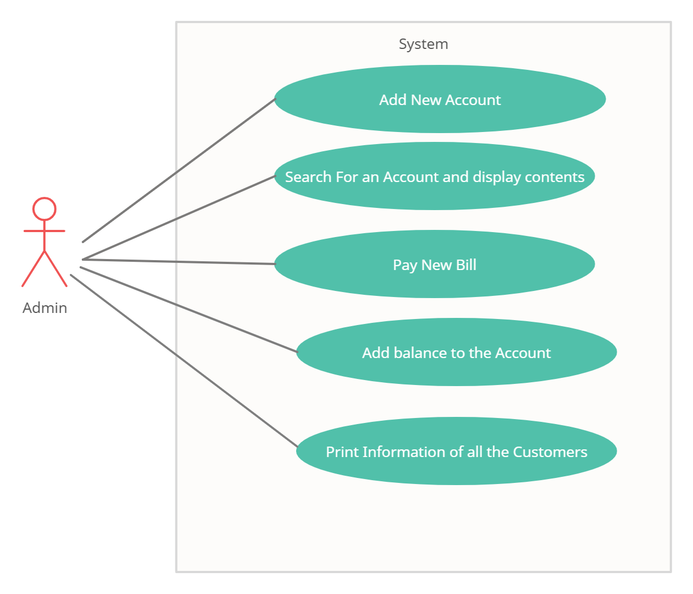

# Requirements
## Introduction
* The growth in business also lead to the growth in the need of E-billing applications using Wallets Records where all the information regarding the customer transanctions in that departmental store can be maintained online.
* Cutomer Billing System is a console based application where a customer can create and maintain an account. This account contains all the information of the customer and also the account can be edited as and when required.

## Customer Wallet Record System Features

The main aim of Customer Billing System is to maintain the information and payment history of the customer.It has the capacity to illustrate and analyze the basic billing system and the main functionalities that surround the billing system from a business prospective and explains how each interacts to complete the billing cycle.
It capable of billing more quickly, accurately and update customer record and enables customer to view bill information.

### Services Offered to the Customers
* A customer can create an account for his own and give his details such as address to be stored.
* This helps the store to provide home delivery to the customer.
* The billing history of the customer is maintained.
* The customer can maintain some amount as balance to pay cash less as and when required in any brach of that departmental store.
* The customer can edit the information in his account as and when required.

### Services
Service is the entity offered by the company and targeted to the customers.

### Accounts
The customer account includes customer contact, profile information, account number, city and balance amount in the account.

### Payments
Each customer in the system has an account balance, which affects any invoices requested by the customer and any payments done by the customer.

## Cost and Features

## System Definition

### Integration
The Customer Wallet Record System interacts with :
  * Banking applications
  * Firewalls
  * Authentication gateways
  

### Features Provided in the Program
* To create New Account
* To update the existing account
* To print information of all the customers
* To search for an account
* Adding Amount to Existing Customer's Wallet

## SWOT Analysis

# High and Low Level Requirements

## High Level Requirements

| ID  | Description  | Category  | Status  |
| --- | ------------ | --------- | ------- |
| HR01| New customer can create account | Techinal | TBI |
| HR02| Customer can mantain a Balance | Technical | TBI |
| HR03| Customer information can be displayed| Technical | TBI|
| HR03| Customer can pay the bill from e-wallet | Techinal | TBI|
| HR04| Customer can maintain money in account's wallet| technical|TBI|
| HR05| The last transaction amount of the custmoer in the store have to be maintained| Technical | TBI|
| HR06| Customer can opt for home delivery | Technical | FUTURE|
| HR07| The data should not be lost during failure | Scenario | FUTURE|
| HR08| The information of the customer sould not be leaked| Scenario | FUTURE|
| HR09| All the tracsanctions fron the creation of the account have to be maintained | Technical | FUTURE|

## Low Level Requirements

|ID | Description | HRID | Status|
|---|-------------|------|-------|
|LR01| For Each new account a new array cell of structure type have to be created| HR01 | TBI|
|LR02| Balance can be mantanied by creating a structure array each cell holding information of the user and their balance| HR02| TBI|
|LR03| Customer information can be displayed by printing the structure array| HR03| TBI|
|LR04| When paying bill the balance attribute is modified and updated| HR04|TBI|
|LR05| The home delivery option cane be implemented by taking the address of the customer|HR06|FUTURE|
|LR06| The data can be protected by using file to store all the data|HR07|FUTURE|
|LR07| The authentication mechanisms have to be implementd to prevent data leakage|HR08|FUTURE|
|LR08| All the transactions can be maintained in a file dedicated to that customer|HR08|FUTURE|

